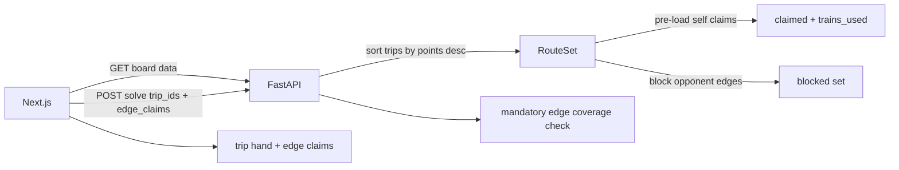

# Ticket to Ride — Frontend + Vercel Plan

Phased plan for an interactive web app: visual board map, edge ownership (yours vs
opponent), incremental trip planning, and auto-rerouting that maximizes points.

**Status:** Decisions locked — ready for Phase 1 implementation

---

## Decisions (locked)

| Question | Answer |
|----------|--------|
| Edge input | **Map only** — click edges to set ownership |
| Edge ownership | **Cycle per click:** unclaimed → yours → opponent → unclaimed |
| Self-claimed edges | **Mandatory** — fixed track you've placed; must appear on a ticket route |
| Opponent-claimed edges | **Blocked** — cannot traverse |
| Ticket selection | **Incremental** — add trips as drawn in-game |
| Routing priority | **Highest points first** — high-value tickets claim contested track before low-value |
| Recalculation | **Automatic** on trip or edge-claim change |
| Repo layout | **`frontend/` subfolder** |

---

## Goal

1. Interactive map of the full board
2. Click any edge to claim it **for yourself** or **for an opponent**
3. Self-claims are mandatory fixed infrastructure (already built)
4. Add destination tickets one at a time as you draw them
5. Routes auto-update; solver prioritizes **maximum total points**
6. High-point tickets route before low-point tickets when competing for track

Deploy on **Vercel Hobby (free)**.

---

## Edge ownership model

### Three states (click to cycle)

| State | Color (proposed) | Meaning |
|-------|------------------|---------|
| Unclaimed | Gray | Open track — solver may place trains here |
| Yours | Blue | You've built this segment — **mandatory**, counts toward 45 trains |
| Opponent | Red | Blocked — cannot use |

**Click behavior:** `unclaimed → yours → opponent → unclaimed`

### Mandatory self-claims

When you mark an edge as **yours**, you're recording track already on the board:

1. **Train budget:** `train_cost` deducted from your 45 immediately (pre-claim)
2. **Free reuse:** Later ticket paths traverse it at zero additional train cost
3. **Must be used:** Every self-claimed edge must appear on **at least one** ticket
   path in the solution. If no valid routing covers all mandatory edges, UI flags
   the conflict (e.g. "KC→Denver claimed but no ticket uses it")

Opponent claims are the inverse: pathfinding treats the edge as absent.

### Routing priority (highest points)

When solving a hand of tickets:

1. **Sort tickets by point value descending** (not add order)
2. Route highest-point ticket first → gets best uncontested paths
3. Lower-point tickets route afterward, reusing your claimed track for free
4. Within a single ticket, existing `add_trip` tie-break already prefers more
   route points among equal-train paths

Objective: **maximize total score** (ticket points + newly placed route points)
subject to mandatory self-edges, opponent blocks, and 45-train cap.

---

## Architecture

```
ticket-to-ride-optimal-trips/
├── frontend/
│   ├── app/
│   ├── components/
│   │   ├── MapBoard.tsx      # SVG + edge click cycle
│   │   ├── EdgeLegend.tsx    # unclaimed / yours / opponent
│   │   ├── TripHand.tsx
│   │   └── TripPicker.tsx
│   └── lib/
│       ├── api.ts
│       ├── gameState.ts      # trips, edgeClaims, routes
│       └── coords.ts
├── src/ttro/
│   ├── api/                  # edge_claims on /solve
│   └── solver/               # blocked + pre-claimed + mandatory validation
├── scripts/
│   ├── seed_db.py
│   └── vercel_build.py
├── pyproject.toml
├── vercel.json
└── PLAN.md
```

### Data flow



**State:** browser + `localStorage` (trips + edge claims).

---

## Interaction model

### Map (edge claims)

- Click edge → cycle ownership (gray → blue → red → gray)
- Hover tooltip: cities, train cost, route points, current owner
- "Clear all claims" resets map
- Self-claimed edges show even before tickets are added (fixed infrastructure)

### Trip hand

- Add one trip at a time from remaining deck (max 10)
- Remove trip with ✕
- Auto-recalculate on any change (debounced ~300ms)

### Solve results (sidebar)

- Total points, trains used / 45
- Per-ticket: path summary, unreachable flag
- **Warnings:**
  - Mandatory edge not covered by any route
  - Over 45 trains
  - Ticket unreachable due to opponent blocks

### No auto-combo search in UI

Frontend only evaluates the tickets in hand. CLI `auto=true` unchanged.

---

## Backend changes

### RouteSet extensions

```python
class RouteSet:
    def __init__(self, graph, *, blocked: set[frozenset], pre_claimed: set[frozenset]):
        self.blocked = blocked          # opponent — untraversable
        self.claimed = set(pre_claimed) # yours — free reuse, pre-counted trains
        self.trains_used = sum(train_cost for each pre_claimed edge)
```

- `_distance`: `inf` if blocked; `0` if in `claimed`; else `1` (hop count)
- `add_trip`: unchanged tie-break (min new trains, then max route points)

### Solve flow

```python
def evaluate_hand(trip_ids, edge_claims):
    trips = load_trips(trip_ids)
    trips.sort(key=lambda t: t.points, reverse=True)  # highest points first

    blocked = {edges where owner == "opponent"}
    pre_claimed = {edges where owner == "self"}

    routes = RouteSet(graph, blocked=blocked, pre_claimed=pre_claimed)
  # route each trip in sorted order ...
    uncovered = pre_claimed - edges_used_in_all_paths(paths)
    return result + warnings for uncovered mandatory edges
```

### API

```python
class EdgeClaim(BaseModel):
    city_a: str
    city_b: str
    owner: Literal["self", "opponent"]

class SolveRequest(BaseModel):
    trip_ids: list[int]
    edge_claims: list[EdgeClaim] = []

class SolveResponse(BaseModel):
    points: int
    trains_used: int
    routes: list[RouteResult]       # ordered by points desc (routing order)
    trips: list[list]
    unreachable: list[int]          # trip_ids with no valid path
    unused_mandatory: list[tuple[str, str]]  # self-claimed edges not on any route
```

---

## Frontend components

| Component | Responsibility |
|-----------|----------------|
| `MapBoard` | SVG board; click cycle ownership; route overlays |
| `EdgeLegend` | Gray / blue / red key |
| `TripHand` | Cards, remove, score summary, warnings |
| `TripPicker` | Add trip from deck |
| `useGameState` | trips + edgeClaims → debounced solve |

### Visual layers (bottom → top)

1. All edges (gray default)
2. Self-claimed (blue, thick)
3. Opponent-claimed (red, thick)
4. Computed ticket routes (distinct colors per ticket, on top)

---

## Phases

### Phase 1 — Vercel foundation
- [ ] `scripts/vercel_build.py`, `pyproject.toml`, `vercel.json`
- [ ] Scaffold `frontend/` Next.js shell
- [ ] Deploy; API + frontend live

### Phase 2 — Static map
- [ ] `MapBoard` SVG from `/cities` + `/tracks`
- [ ] Coordinate normalization, hover tooltips
- [ ] Map + sidebar layout

### Phase 3 — Edge ownership (map)
- [x] Click cycle: unclaimed → self → opponent → unclaimed
- [x] `EdgeLegend` component
- [x] Clear-all; `localStorage` for edge claims

### Phase 4 — Backend solver
- [x] `RouteSet`: `blocked` + `pre_claimed` sets
- [x] Sort trips by points descending
- [x] `unused_mandatory` validation
- [x] `SolveRequest.edge_claims` API

### Phase 5 — Trip hand + auto-solve
- [x] `TripPicker` + `TripHand` (incremental, max 10)
- [ ] Auto-solve on trip or edge change
- [ ] Draw routes; show warnings in sidebar

### Phase 6 — Polish
- [ ] New vs reused track styling on routes
- [x] Loading state; `localStorage` for trip hand
- [ ] README deploy section; responsive layout

---

## Vercel setup (one project)

1. **One** Vercel project linked to this repo
2. **Settings → General → Root Directory** → **blank** (repo root, NOT `frontend`)
3. **Settings → Build → Framework Preset** → **Other** or auto-detected FastAPI
   (do NOT use "Services" or set root to `frontend`)
4. Remove `API_URL` env var if set
5. Push `main` and redeploy

Build exports Next.js to `public/`; FastAPI serves `/health`, `/cities`, etc. on
the **same domain** as the map (`/`).

---

## Resume checklist

1. Read this file — check phase checkboxes
2. `pip install -e .` → `python scripts/seed_db.py`
3. `vercel dev` (or separate frontend + uvicorn)
4. Continue next unchecked phase
